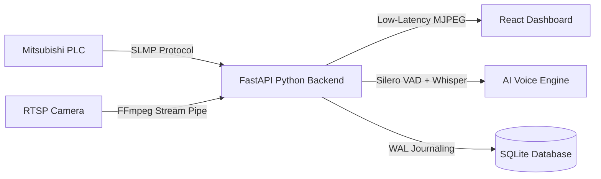

# Project Presentation: Rico Camera Capture

This document contains presentation slides designed for senior-level management. It is formatted sequentially so you can present it directly or easily copy the content into a PowerPoint template.

---

````carousel
# Slide 1: Title Slide
## RICO CAMERA CAPTURE & STOPPAGE ANALYZER
### AI-Powered Industrial Stoppage Recorder and Voice Log System

* **Project Goal**: Automate machine stoppage logging and capture operator voice commentary using low-latency video streaming, PLC monitoring, and AI voice transcription.
* **Target Environment**: Shop floor / Industrial manufacturing cells.
* **Presented to**: Senior Leadership Team.

<!-- slide -->
# Slide 2: The Problem Statement & Context
## Challenges in Manual Stoppage Tracking

* **Manual Logging Errors**: Operators often fail to log short stoppages or record inaccurate timestamps.
* **Lack of Visual Proof**: Supervisors have no way to visually verify what caused a minor stoppage or breakdown after it occurs.
* **High Stoppage Volumes**: Minor stoppages (< 2 minutes) happen frequently but are rarely logged, leading to major hidden efficiency losses.
* **Analysis Hurdles**: Text-based comments are time-consuming to input on industrial panels, resulting in generic comments like "machine stopped".

<!-- slide -->
# Slide 3: The Solution Overview
## Automated Recording & Voice Justification

* **PLC Integration**: The system automatically detects stoppages (Gate Open / Machine Stop) via the machine's PLC.
* **Automatic Recording**: Video recording triggers instantly and is compiled without CPU overhead.
* **Voice-to-Text Commentary**: For extended breakdowns (> 2 mins), operators record their explanation using a microphone.
* **AI Transcription**: Advanced transcription models translate the audio logs into structured text reasons automatically.

<!-- slide -->
# Slide 4: Key Features & Functional Modules
## A Complete Closed-Loop Dashboard

1. **Real-time Live View**: Low-latency video streaming with overlay status telemetry (LIVE/OFFLINE, RUNNING/STOPPED).
2. **Interactive Event Library**: A digital log of all stoppage events with durations, file sizes, and category classifications (Minor Stoppage vs. Breakdown).
3. **Voice Recording Overlay**: Operators can review video playback and log their justification via voice input.
4. **Data Exports**: Generate comprehensive Excel / CSV reports containing links to video files and transcribed operator reasons.

<!-- slide -->
# Slide 5: System Architecture & Integration Flow
## How the Technologies Connect


* **Mitsubishi PLC**: Monitored via SLMP (Single-cell Link Message Protocol) over TCP.
* **IP Camera**: Streams RTSP feed cached in-memory.
* **Whisper Engine**: Processes voice comments to extract stoppage reasons.

<!-- slide -->
# Slide 6: Why This is the Best Technical Choice
## Engineered for Stability & Performance

* **Microscopic RAM Footprint**: The backend utilizes only **~73 MB of RAM**, leaving the host PC free for other local applications.
* **Single Camera Connection (Caching)**: Instead of spawning multiple heavy RTSP streams, the system pulls frames once and caches them. This protects the camera hardware from crashing.
* **Silero VAD Voice Filtration**: Voice inputs are filtered to remove loud background factory machine hums and clangs.
* **Self-Repair Database**: Automatically repairs index errors on system startup if a power cut occurs.

<!-- slide -->
# Slide 7: Production Optimization Details
## Ready for the Shop Floor

* **SQLite WAL (Write-Ahead Logging)**: Configured for concurrent read/write transactions. PLC logging and user queries run in parallel without locking.
* **Zero-Transcoding Video Saves**: Video recordings copy native streams (`-c:v copy`) instead of re-encoding. This reduces recording CPU overhead to < 2%.
* **Daemon Thread Schedulers**: All monitors (PLC, Transcription, Camera) run as background daemon threads, terminating safely when the application is stopped.

<!-- slide -->
# Slide 8: Future Roadmap
## Scaling Up the Solution

* **Multi-Machine Integration**: Scaling the centralized Python backend helper to monitor multiple PLCs and cameras from a single server.
* **Predictive Maintenance Alerts**: Analysing transcription logs using NLP to predict recurring failure patterns (e.g., specific tool failures).
* **LLM Analytical Chatbot**: Implementing a private LLM dashboard allowing managers to query stoppage logs using natural language (e.g., *"How many times did we stop due to material shortage this week?"*).
````
