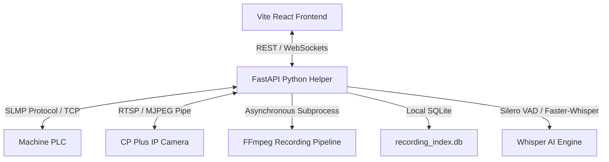
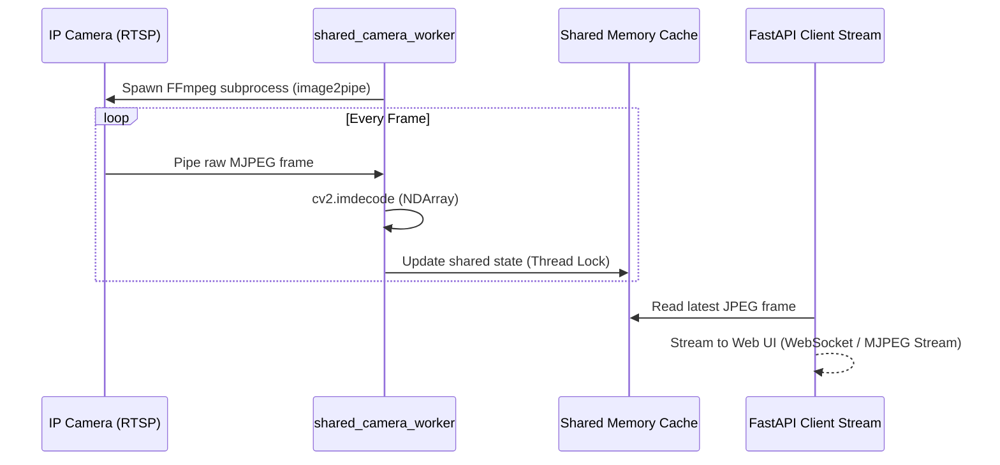

# Rico Camera Capture: Technical Documentation

## 1. System Architecture Overview

The Rico Camera Capture system is an automated industrial monitoring application designed to capture camera recordings of machine stoppage events on the shop floor. By integrating directly with the machine's PLC (Programmable Logic Controller) and an RTSP IP Camera, the application detects state changes, records video, extracts voice commentary, and transcribes stoppage reasons using AI.



### Component Roles
* **Frontend (Vite / React / TypeScript)**: A single-page dashboard displaying the live video feed, real-time machine telemetry, and an interactive Event Report library.
* **Backend Helper (Python / FastAPI / Uvicorn)**: A high-performance standalone service that acts as the coordinator. It manages the camera stream cache, queries the PLC, triggers recording processes, handles database indexes, and executes audio transcription.
* **Database (SQLite)**: A local database containing event durations, reasons, transcription states, and storage metrics.
* **External Integrations**:
  * **Mitsubishi PLC**: Monitored via the SLMP (Single-cell Link Message Protocol) over TCP.
  * **IP Camera (CP Plus)**: Streams live H.264 video feed over RTSP.
  * **Whisper Audio Model**: Transcribes vocal reports recorded by operators to document breakdown reasons.

---

## 2. Low-Latency Camera Caching (`shared_camera_worker`)

IP cameras (like CP Plus) have strict session limits and hardware limits. Direct multi-client RTSP connections degrade performance. The backend solves this by implementing a **Shared Camera Frame Cache**.



### Technical Implementation Detail
* **FFmpeg Pipeline**: A background worker launches a subprocess using `subprocess.Popen` that connects to the camera's RTSP feed, scales the frames, and outputs raw MJPEG streams over a standard output pipe:
  ```bash
  ffmpeg -rtsp_transport tcp -i rtsp://... -vf scale=min(1280,iw):-2,fps=10 -f image2pipe -vcodec mjpeg pipe:1
  ```
* **Thread-Safe Memory Buffer**: A dedicated Python thread parses the standard output stream for JPEG magic bytes (`\xff\xd8` and `\xff\xd9`). The frame is decoded using OpenCV (`cv2.imdecode`) and stored in a globally locked dictionary (`shared_camera_state`) protected by a `threading.Lock`.
* **Multiplexing**: The FastAPI server reads frames from the shared dictionary to serve live view clients. This ensures the camera is hit with exactly **one RTSP connection** regardless of the number of active users.

---

## 3. PLC Machine Monitoring (SLMP Protocol)

The backend monitors machine states in real time by connecting to the PLC's memory devices using the SLMP (Single-cell Link Message Protocol).

### Protocol Mechanics
* **TCP Connection**: The helper maintains a TCP connection to the PLC (typically port `5007` or `12289` for Mitsubishi PLCs).
* **Bit Address Parsing**: It reads PLC status flags (e.g. M-coils or bits) representing signals like:
  * `Machine Running` (e.g., M100)
  * `Breakdown Trigger` (e.g., M101)
  * `Gate Open / Stoppage Trigger` (e.g., M102)
* **Failover Logic**: If a TCP request fails, the handler falls back to alternative port candidates, logs diagnostic errors, and reconnects automatically without breaking execution loops.

---

## 4. Stoppage Event Recording Engine

When a stoppage signal (Gate Open) is received from the PLC, the system triggers the Recording Engine.

### Recording States
* **Minor Stoppage (< 2 mins)**: A short operational interrupt. The event duration and video are logged as minor.
* **Breakdown (> 2 mins)**: An extended machine stoppage. The operator must record a vocal explanation to clear the breakdown.

```
PLC State Change: Gate Open (M102)
       |
       v
Start FFmpeg recording subprocess
       |
       v
PLC State Change: Gate Close (M102 off)
       |
       +---> If Event Duration < 2 mins ---> Classify as MINOR STOPPAGE (Completed)
       |
       +---> If Event Duration > 2 mins ---> Classify as BREAKDOWN ---> Trigger Whisper AI
```

### Video Recording Subprocess
Recording is handled asynchronously via a separate native FFmpeg worker process:
```bash
ffmpeg -rtsp_transport tcp -i rtsp://... -c:v copy -an -y -metadata title="Machine Stoppage Event" event_recording.mp4
```
By using `-c:v copy`, the video stream is dumped directly to disk without CPU re-transcoding, ensuring near-zero CPU footprint on the host PC during recording events.

---

## 5. Voice Filtration & AI Transcription

Operators record audio comments via their microphone. The voice input undergoes real-time filter processing and is converted to text using AI.

### Pipeline Steps
1. **Audio Extraction**: FFmpeg extracts and resamples the audio track into a single-channel `16000Hz` WAV file (the optimal format for transcription models):
   ```bash
   ffmpeg -i input_video.mp4 -vn -ac 1 -ar 16000 -af "highpass=f=200,lowpass=f=3000" output_audio.wav
   ```
2. **Bandpass Bandwidth Filtering**: Standardized highpass (`200Hz`) and lowpass (`3000Hz`) filters remove low-frequency factory machine hums and high-frequency industrial noise.
3. **VAD (Voice Activity Detection)**: The backend utilizes **Silero VAD** prior to feeding audio to Whisper. VAD isolates segments containing human speech, ignoring background tool drops, metal clangs, or silent intervals.
4. **Whisper AI Engine (`faster-whisper`)**: The isolated speech wave is transcribed using `WhisperModel` loaded with an optimized quantized model (e.g., `int8` quantization) for swift execution on CPU.
5. **Junk Transcript Filtering**: Transcripts with high `no_speech_prob` values are ignored. Stale recordings containing only noise are marked as `No voice detected` to prevent garbage text insertion in the database.

---

## 6. Database Schema & Persistence

All records, event timings, file sizes, and operator categorization reports are persisted in a local SQLite database file `recording_index.db`.

### `recordings` Table Schema
| Column Name | SQLite Data Type | Description |
| :--- | :--- | :--- |
| `id` | INTEGER PRIMARY KEY | Unique auto-increment identifier |
| `file_path` | TEXT UNIQUE | Absolute filesystem path of the video clip |
| `file_name` | TEXT | Name of the video file |
| `started_at` | TEXT (ISO 8601) | Date and time when recording started |
| `ended_at` | TEXT (ISO 8601) | Date and time when recording ended |
| `duration_seconds` | REAL | Total recorded video duration in seconds |
| `event_type` | TEXT | Stoppage classification: `'minor_stoppage'` or `'breakdown'` |
| `status` | TEXT | Process status: `'completed'`, `'running'`, or `'error'` |
| `reason` | TEXT | Text field containing the voice transcription or operator text correction |
| `transcript_status`| TEXT | Speech transcription state: `'saved'`, `'skipped'`, or `'failed'` |
| `updated_at` | TEXT (ISO 8601) | Last row modification timestamp |

### Database Optimization Mechanisms
* **Write-Ahead Logging (WAL)**: Enabling WAL mode (`PRAGMA journal_mode=WAL;`) allows concurrent database reads while the background thread logs PLC signals, avoiding thread block locks.
* **Auto-Repair Startup Patch**: If the host PC shuts down abruptly during a recording event, the database could leave the record marked as `'running'`. On startup, the backend automatically performs a database self-repair:
  ```sql
  UPDATE recordings
  SET status = 'completed',
      ended_at = COALESCE(ended_at, started_at),
      duration_seconds = COALESCE(duration_seconds, 0)
  WHERE status = 'running' OR ended_at IS NULL;
  ```
  This guarantees that stale event entries are resolved and prevents them from cluttering the user interface as active recordings.

---

## 7. Deployment Configuration

The application is configured using a `.env` environment file.

### Recommended Environment Variables (`.env`)
```ini
# Server Configuration
HOST=0.0.0.0
PORT=8010

# Database & Storage
STORAGE_ROOT=C:\CPPLUS_RECORDINGS
SQLITE_DB_NAME=recording_index.db

# Camera RTSP & Network Configurations
CAMERA_IP=192.168.119.205
CAMERA_RTSP_PORT=554
CAMERA_USERNAME=admin
CAMERA_PASSWORD=secret_password
CAMERA_CHANNEL=1

# PLC SLMP Interface
PLC_IP=192.168.119.10
PLC_PORT=5007
PLC_ENABLED=true

# AI Whisper Transcription settings
TRANSCRIPTION_USE_FASTER_WHISPER=true
TRANSCRIPTION_MODEL=base
TRANSCRIPTION_LANGUAGE=en
TRANSCRIPTION_VAD_FILTER=true
TRANSCRIPTION_AUDIO_FILTER=highpass=f=200,lowpass=f=3000
```
